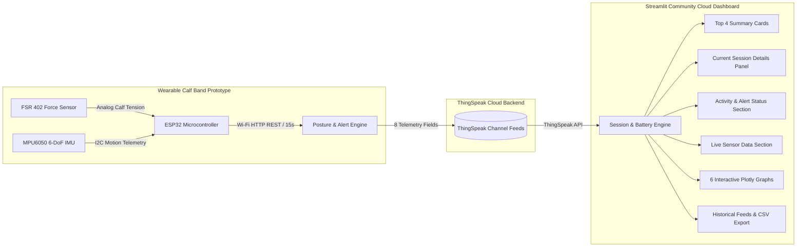

# 🦵 SMART CALF SENSE

> **IoT-Based Calf Muscle Activity & Prolonged Standing Monitoring System with Session & Battery Intelligence**


---

## 1. System Architecture



### Exact Pipeline
**ESP32 + FSR402 + MPU6050 → Wi-Fi → ThingSpeak → Python Streamlit Dashboard**

1. **ESP32 Wearable Band:** Samples the **FSR 402** sensor (monitoring calf muscle tension/pressure) and **MPU6050** accelerometer & gyroscope (motion, tilt angle, stepping cadence).
2. **ThingSpeak Cloud Storage:** Centralized time-series database ingesting 8 telemetry fields.
3. **Streamlit Community Cloud Dashboard:** Fetches live feeds via the ThingSpeak API, evaluating connection state, tracking sessions, modeling battery consumption, and auto-refreshing every 15 seconds.

---

## 2. Top Summary Cards

The dashboard features 4 prominent, dedicated summary cards:

```text
┌──────────────────┐  ┌──────────────────┐  ┌──────────────────┐  ┌──────────────────┐
│ CONNECTION       │  │ EST. BATTERY     │  │ TOTAL STANDING   │  │ CURRENT SESSION  │
│ ● CONNECTED      │  │ 82%              │  │ 2h 34m           │  │ 18m 42s          │
│ Session #3       │  │ Current session  │  │ All sessions     │  │ Session #3       │
└──────────────────┘  └──────────────────┘  └──────────────────┘  └──────────────────┘
```

---

## 3. Session & Heartbeat Logic

### Session Definition
A **new session** begins whenever the ESP32 establishes a new connection after being disconnected.

- **Heartbeat Timeout (45s):** Because ThingSpeak updates every ~15 seconds, a 45-second window (3 missed packets) distinguishes temporary network latency from actual disconnection.
- **When ESP32 Disconnects:**
  - Status transitions to `● DISCONNECTED — SESSION ENDED`.
  - Current session timer stops.
  - Estimated battery calculation for that session freezes.
  - **Total Standing Time is preserved.**
- **When ESP32 Reconnects:**
  - A **NEW SESSION** is initialized (e.g. Session #3 $\to$ Session #4).
  - **Current Session Standing Time resets to `00:00:00`**.
  - **Estimated Battery resets to `100%`**.
  - **Total Standing Time remains accumulated** and continues adding new standing seconds.

---

## 4. Estimated Battery Model & Assumptions

> [!IMPORTANT]
> **No Battery Measurement Hardware:** The wearable band does **not** contain a battery voltage sensor, voltage divider, or fuel gauge IC. Battery percentage is **never claimed to be measured**; it is an engineering estimate derived from operating time and component power consumption.

### Battery Assumptions:
1. **Charge Before Use:** The device is assumed to be fully charged (100%) before each usage session.
2. **Session Reset:** Every new ESP32 connection begins with **Estimated Battery = 100%**. The previous session's battery consumption **does not carry over**.
3. **Power Consumption Model:**
   - **Configurable Battery Capacity:** Default $2000\text{ mAh}$ (adjustable in the sidebar).
   - **Base Current Draw ($I_{\text{base}}$):** $\approx 140\text{ mA}$ (ESP32 active + Wi-Fi bursts every 15s + MPU6050 + FSR).
   - **Vibration Feedback Motor ($I_{\text{vib}}$):** $+80\text{ mA}$ during `WARNING` or `ALERT` prompts ($\approx 220\text{ mA}$ total).
4. **Formula:**
   $$\text{Consumed (mAh)} = \sum \frac{I_{\text{sample}} \times \Delta t_{\text{hours}}}{1}$$
   $$\text{Estimated Battery \%} = \max\left(0, \min\left(100, \frac{\text{Capacity} - \text{Consumed}}{\text{Capacity}} \times 100\right)\right)$$
5. **Warning Thresholds:**
   - $> 30\%$: Normal (`🟢`)
   - $15\%\text{--}30\%$: Low (`🟡`)
   - $5\%\text{--}15\%$: Very Low (`🟠`)
   - $< 5\%$: Critical (`🔴`)

---

## 5. Interactive Graph Suite (6 Plotly Charts)

| Graph | Title | Axes | Description |
| :--- | :--- | :--- | :--- |
| **A** | **FSR Pressure Trend** | $X$: Time, $Y$: FSR Value | Dynamic calf muscle contraction and relaxation curves. |
| **B** | **Motion / Accelerometer Trend** | $X$: Time, $Y$: Acceleration ($g$) | Tri-axial acceleration (Accel X, Y, Z) with interactive legend. |
| **C** | **Gyroscope Activity** | $X$: Time, $Y$: Angular Rate ($^{\circ}/s$) | Net rotational velocity of the calf during posture changes. |
| **D** | **Standing Time Progression** | $X$: Time, $Y$: Standing Duration (min) | Progression of continuous standing in the current session with 30-min threshold line. |
| **E** | **Activity Timeline & Posture History** | $X$: Time, $Y$: Postural State | Visual stepped timeline showing when the user was `SITTING`, `STANDING`, `WALKING`, or `MOVING`. |
| **F** | **Estimated Battery Usage** | $X$: Time, $Y$: Estimated Battery % | Depicts battery depletion curve for the current session starting from 100%. |

---

## 6. ThingSpeak Data Fields

| Field Number | Sensor / Data Name | Values | Description |
| :--- | :--- | :--- | :--- |
| **Field 1** | **FSR** | ADC / Raw (0–4095) | Calf muscle tension from FSR402 |
| **Field 2** | **Accelerometer X** | $g$ | Lateral motion axis |
| **Field 3** | **Accelerometer Y** | $g$ | Anterior-posterior tilt |
| **Field 4** | **Accelerometer Z** | $g$ | Vertical gravity alignment |
| **Field 5** | **Gyro Magnitude** | $^{\circ}/s$ | Net calf angular rotational velocity |
| **Field 6** | **Activity** | `SITTING`, `STANDING`, `WALKING`, `MOVING`, `UNKNOWN` | Biomechanical posture classified on ESP32 |
| **Field 7** | **Standing Time** | `min` (e.g. `18 min`) | Continuous standing duration |
| **Field 8** | **Alert** | `NORMAL`, `WARNING`, `ALERT` | Prolonged standing & fatigue alert state |

---

## 7. Local Setup & Testing

### Step 1: Install Dependencies
```bash
pip install -r requirements.txt
```

### Step 2: Run Automated Test Suite
To verify the complete session lifecycle and battery model (TEST 1 to TEST 6):
```bash
python test_sessions.py
```
Expected output:
```text
[TEST 1] Starting ESP32... -> PASSED (Session 1, Battery 100%, CONNECTED)
[TEST 2] Standing for 30 minutes in Session 1... -> PASSED (30 min, Battery 93%)
[TEST 3] Disconnecting ESP32... -> PASSED (Status DISCONNECTED, Total preserved)
[TEST 4] Reconnecting ESP32 (Session 2 begins)... -> PASSED (Session 2, Battery resets to 100%)
[TEST 5] Checking all 6 dashboard graphs... -> PASSED (All 6 Plotly figures rendered)
[TEST 6] Verifying battery isolation across sessions... -> PASSED (Session 2 starts fresh from 100%)
ALL 6 TESTS PASSED WITH 100% SUCCESS!
```

### Step 3: Run the Dashboard
```bash
streamlit run app.py
```
Open in browser:
```text
http://localhost:8501
```

---

## 8. Streamlit Community Cloud Deployment

1. Push the repository to GitHub:
```bash
git add .
git commit -m "feat: complete Smart Calf Sense dashboard with battery & session logic"
git push origin main
```
2. Navigate to [share.streamlit.io](https://share.streamlit.io/) and create a new app.
3. In **Settings > Secrets**, add:
```toml
THINGSPEAK_CHANNEL_ID = "YOUR_CHANNEL_ID"
THINGSPEAK_READ_API_KEY = "YOUR_READ_API_KEY"
```
4. Access your live worldwide URL at:
```text
https://<your-custom-subdomain>.streamlit.app
```
